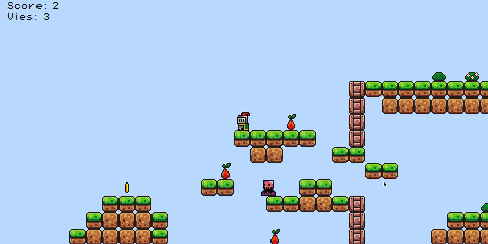

# p5play - template game

	

### develop

1. use vscode
2. use `live server` extension
3. head over to `http://localhost:5500`

### publish for prod

1. upload as a github repo
2. deploy with `github pages`
3. head over to `https://<username>.github.io/<repo>/`

---

#### Credits

Assets: [itch.io/brackeys-platformer-bundle](https://brackeysgames.itch.io/brackeys-platformer-bundle)